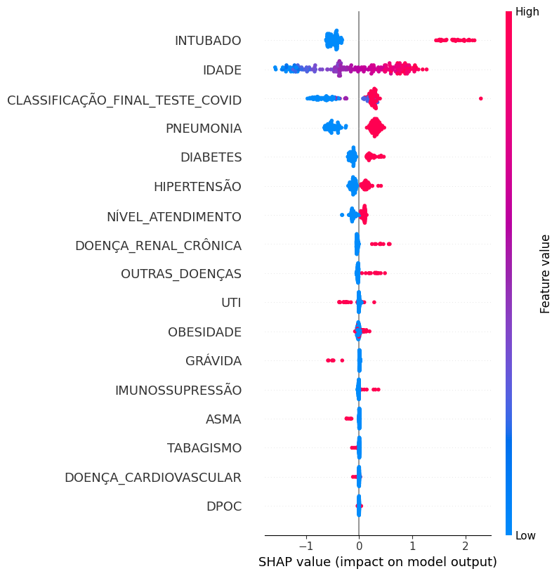
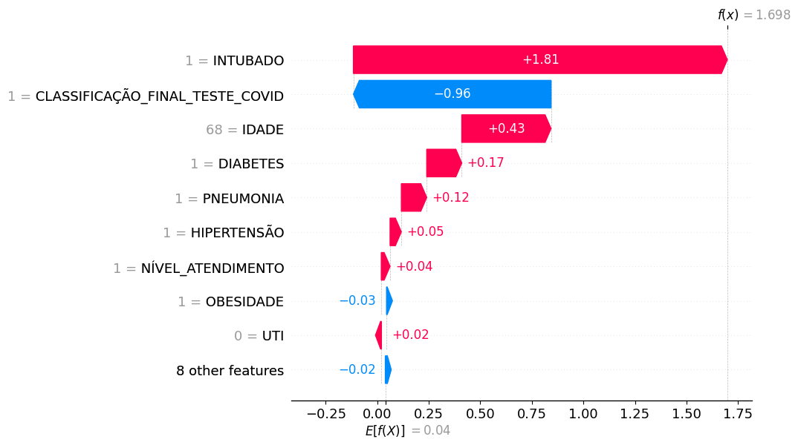

# O Questionário

Este documento descreve o mapeamento numérico das respostas do questionário para armazenamento no banco de dados.

---

# Estrutura Geral

O questionário está dividido em duas categorias:

- Pré-Pesquisa  
- Pesquisa

Cada categoria possui um padrão específico de valores numéricos.

---

# Pré-Pesquisa 

## 1.1 Data de nascimento
- **Frontend:** campo de data  
- **Backend:** string no formato ISO (`YYYY-MM-DD`)

---

## 1.2 Sexo

| Frontend            | Backend  |
|---------------------|----------|
| Masculino           | `male`   |
| Feminino            | `female` |
| Não quero informar  | `other`  |

---

## 1.3 Estado de atuação
- **Frontend:** "São Paulo (SP)"  
- **Backend:** `"SP"`

---

## 1.4 Cidade de atuação
- **Frontend:** "Campinas"  
- **Backend:** `"Campinas"`

---

## 1.5 Especialidades
- **Frontend:** nomes das especialidades  
- **Backend:** array de strings  

Exemplo:
```json
["Angiologia", "Cardiologia"]
```

---

## 1.6 Tempo de atuação (anos)
- **Frontend:** número digitado  
- **Backend:** string contendo apenas dígitos  

Exemplo:
```json
"10"
```

---

## 1.7 Principais locais de trabalho

| Frontend                      | Backend            |
|-------------------------------|--------------------|
| Hospital privado / convênio   | `private_hospital` |
| Hospital público              | `public_hospital`  |
| Hospital escola               | `teaching_hospital`|
| UBS / PSF                     | `ubs_psf`          |
| Consultório particular        | `private_clinic`   |

Exemplo:
```json
["public_hospital", "ubs_psf"]
```

---

## 1.8 Categoria atual

| Frontend             | Backend      |
|----------------------|-------------|
| Residente            | `resident`  |
| Médico especialista  | `specialist`|

---

## 1.9 Frequência de uso de IA (pre-usage)

"Com que frequência você utiliza sistemas baseados em IA ou algoritmos de apoio à decisão clínica?"

| Frontend            | Backend |
|---------------------|--------|
| Nunca               | 1 |
| Raramente           | 2 |
| Às vezes            | 3 |
| Frequentemente      | 4 |
| Muito frequentemente| 5 |

---

## 1.10 Conhecimento em XAI (pre-knowledge)

"Antes desta pesquisa, qual era seu nível de conhecimento sobre explicabilidade em modelos de IA (XAI)?"

| Frontend                     | Backend |
|------------------------------|--------|
| Nenhum conhecimento          | 1 |
| Conhecimento muito básico    | 2 |
| Conhecimento intermediário   | 3 |
| Conhecimento avançado        | 4 |
| Conhecimento muito avançado  | 5 |

---

## 1.11 Experiência com ferramentas explicáveis (pre-tools)

"Qual é o seu nível de experiência com ferramentas que explicam as decisões de modelos de IA?"

| Frontend                     | Backend |
|------------------------------|--------|
| Nenhuma experiência          | 1 |
| Experiência muito limitada   | 2 |
| Experiência moderada         | 3 |
| Experiência significativa    | 4 |
| Experiência extensa          | 5 |


# PESQUISA

Perguntas avaliadas por escala Likert de concordância.
A Figura 1 é a explicação global e a Figura 2 é a explicação local.

---

## Variáveis clínicas do dataset

Variáveis do dataset clínico (COVID-19) utilizadas no treinamento do modelo preditivo e sobre as quais as explicações das Figuras 1 e 2 são geradas.

| Variável                        | Descrição                                                | Valores válidos                                       |
|---------------------------------|----------------------------------------------------------|-------------------------------------------------------|
| IDADE                           | Idade do paciente                                        | Valor numérico (anos)                                 |
| NÍVEL ATENDIMENTO               | Pertence à unidade de vigilância epidemiológica (USMER)  | 0 = Não; 1 = Sim                                      |
| INTUBADO                        | Foi intubado                                             | 0 = Não; 1 = Sim                                      |
| PNEUMONIA                       | Diagnóstico de pneumonia                                 | 0 = Não; 1 = Sim                                      |
| GRÁVIDA                         | Paciente estava grávida                                  | 0 = Não; 1 = Sim                                      |
| DIABETES                        | Possui diabetes                                          | 0 = Não; 1 = Sim                                      |
| DPOC                            | Doença pulmonar obstrutiva crônica                       | 0 = Não; 1 = Sim                                      |
| ASMA                            | Possui asma                                              | 0 = Não; 1 = Sim                                      |
| IMUNOSSUPRESSÃO                 | Imunossuprimido                                          | 0 = Não; 1 = Sim                                      |
| HIPERTENSÃO                     | Possui hipertensão                                       | 0 = Não; 1 = Sim                                      |
| OUTRAS DOENÇAS                  | Possui outras doenças                                    | 0 = Não; 1 = Sim                                      |
| DOENÇA CARDIOVASCULAR           | Doença cardiovascular                                    | 0 = Não; 1 = Sim                                      |
| OBESIDADE                       | Possui obesidade                                         | 0 = Não; 1 = Sim                                      |
| DOENÇA RENAL CRÔNICA            | Doença renal crônica                                     | 0 = Não; 1 = Sim                                      |
| TABAGISMO                       | Fumante                                                  | 0 = Não; 1 = Sim                                      |
| UTI                             | Internação em UTI                                        | 0 = Não; 1 = Sim                                      |
| CLASSIFICAÇÃO FINAL TESTE COVID | Resultado final do teste                                 | 1 a 4 = Não portador ou teste inconclusivo; 5, 6, 7 = COVID diagnosticado (quanto maior, maior o grau) |
| ÓBITO                           | Indicador final de falecimento                           | 0 = Não; 1 = Sim                                      |

---

## Explicações apresentadas no questionário

### Figura 1 — Explicação Global (SHAP)

A explicação global é apresentada na Figura 1 e o texto utilizado para descrevê-la é apresentado a seguir:

> O gráfico apresenta uma análise abrangendo todos os pacientes do conjunto de dados. À esquerda, encontram-se as variáveis consideradas pelo modelo, como, por exemplo, a presença ou ausência de diabetes, onde estão dispostas por relevância, ou seja, as variáveis do topo são consideradas pela ferramenta como mais importantes para a tomada de decisão do modelo. À direita, observa-se uma barra de cores (heatmap), que representa a intensidade dos valores associados a cada variável. Na parte inferior do gráfico, está indicado o SHAP value, que expressa a contribuição de cada variável para a decisão do modelo. As variáveis dispostas no lado esquerdo do gráfico estão ordenadas de acordo com seus respectivos valores de SHAP, de modo que aquelas posicionadas no topo exercem maior influência na previsão do modelo. Por exemplo, as variáveis idade e pneumonia apresentam maior contribuição para a decisão do modelo quando comparadas às variáveis asma e doença cardiovascular. Além disso, a coloração dos pontos fornece informação adicional sobre os valores assumidos por cada variável. No caso da variável pneumonia, os pontos em vermelho representam pacientes que apresentaram pneumonia, sendo que tais valores contribuem de forma mais significativa para que o modelo preveja a ocorrência de óbito, já que apresentam maior SHAP value.



### Figura 2 — Explicação Local (SHAP)

A explicação local é apresentada na Figura 2 e o texto utilizado para descrevê-la é apresentado a seguir:

> O gráfico apresentado corresponde a um SHAP waterfall referente a um paciente específico. Trata-se do caso de um paciente com diagnóstico de pneumonia, 68 anos de idade e histórico de diabetes, que evoluiu para óbito por COVID-19, apresentando um SHAP value final do modelo de f(x) = 1,698. Esse valor é transformado por uma fórmula matemática própria do modelo para ser convertido em probabilidade. Após essa transformação, o valor corresponde a uma probabilidade estimada de aproximadamente 84,5\% de óbito. O gráfico tem início no valor base do modelo, que corresponde à média das predições considerando todos os pacientes do conjunto de dados. A partir desse valor, observa-se como cada variável contribui individualmente para deslocar a predição em direção ao desfecho final. As barras em vermelho indicam variáveis que aumentam a probabilidade estimada de óbito, enquanto as barras em azul representam variáveis que reduzem essa probabilidade. As contribuições são acumuladas sequencialmente até que se atinja o valor final do SHAP (f(x)). Nesse caso específico, as variáveis intubado e idade foram as que mais contribuíram para elevar o risco estimado, ao passo que outras variáveis exerceram efeito contrário, reduzindo a probabilidade final predita pelo modelo.



---

## Perguntas desta categoria

### 2.1 Orientado ao usuário (user-aware)
"A linguagem e o nível de complexidade da explicação são adequados à minha prática profissional?"

| Frontend               | Backend |
|------------------------|--------|
| Discordo totalmente    | 1      |
| Discordo               | 2      |
| Neutro                 | 3      |
| Concordo               | 4      |
| Concordo totalmente    | 5      |

---

### 2.2 Orientado ao contexto (context-aware)

"A explicação apresenta informações relevantes que apoiam minha tomada de decisão clínica?"

| Frontend               | Backend |
|------------------------|--------|
| Discordo totalmente    | 1      |
| Discordo               | 2      |
| Neutro                 | 3      |
| Concordo               | 4      |
| Concordo totalmente    | 5      |

---

### 2.3 Objetividade (objectivity)
"A explicação é objetiva e minimiza minhas possíveis interpretações subjetivas?"

| Frontend               | Backend |
|------------------------|--------|
| Discordo totalmente    | 1      |
| Discordo               | 2      |
| Neutro                 | 3      |
| Concordo               | 4      |
| Concordo totalmente    | 5      |

---

### 2.4 Compreensível (understandability)
"A explicação é clara e fácil de entender?"

| Frontend               | Backend |
|------------------------|--------|
| Discordo totalmente    | 1      |
| Discordo               | 2      |
| Neutro                 | 3      |
| Concordo               | 4      |
| Concordo totalmente    | 5      |

---

### 2.5 Informativo (informative)
"A explicação fornece informações suficientes para que eu compreenda como o sistema chegou à sua decisão?"

| Frontend               | Backend |
|------------------------|--------|
| Discordo totalmente    | 1      |
| Discordo               | 2      |
| Neutro                 | 3      |
| Concordo               | 4      |
| Concordo totalmente    | 5      |